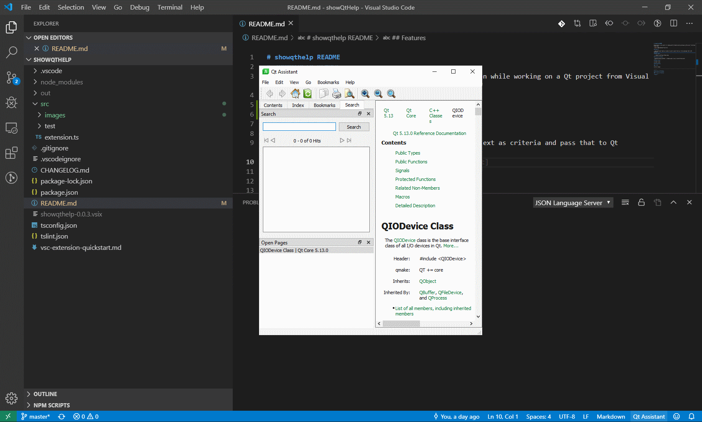

# launchqtcreator README

QtCreator is very useful for certain tasks, and when working on Qt projects, there are things I find Qt Creatro invaluable for. I often use Vislual Studio Code and QtCreator together when working on c++/gui projects

## Features

- launches QtCreator from within code with the click of a button.

## Requirements

- Visual Studio Code
- QtCreator
- recommended that Qt frame work is also installed

## Extension Settings

'launchqtcreator.qtCreatorPath': configure path to use to launch QtCreator

## Known Issues

no known issues

## Release Notes

### 0.0.1

Initial release

-----------------------------------------------------------------------------------------------------------
**Enjoy!**
