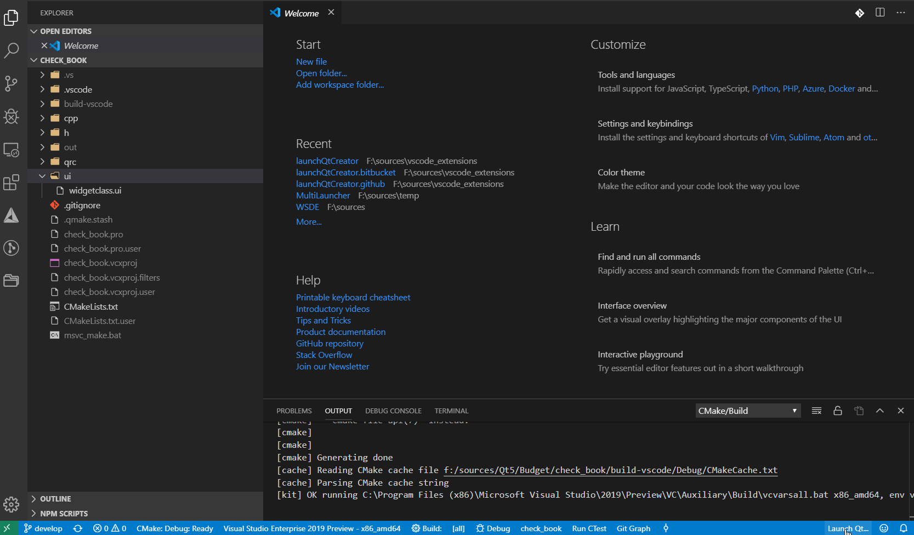

# launchqtcreator README

QtCreator is very useful for certain tasks! When working on Qt projects, there are things I find Qt Creator invaluable for -just too convenient to use anything else (almost). I often use Visual Studio Code and QtCreator together when working on c++/gui projects

## Features

- launches QtCreator or Qt Designer from within code with the click of a button

- launch selected file (*.ui,*.qrc, *.pro, CMakeLists.txt) from
  context menus on
  explorer view or in editor title, or from editor.

- if the path to QtCreator is empty then the user is prompted to
  supply the path via a file open dialog

- if the path to Qt Designer is empty then the user is prompted to
  supply the path via a file open dialog

- ui files can be opened directly in QtCreator or Qt Designer
  (dealers choice)

- *.pro, CMakeLists.txt project files can be opened in QtCreator

- *.qrc files can be opened in QtCreator

## Requirements

- Visual Studio Code
- QtCreator
- recommended that Qt frame work is also installed
- CMake is required for configuring software projects using CMake

## Extension Settings

-'launchqtcreator.qtCreatorPath': configure path to use for launching QtCreator
-'launchqtcreator.qtDesignerPath': configure path to use for launching Qt Designer

## Known Issues

no known issues

## Release Notes

## 0.1.14

- @dependbot xml2js is vulnerable to prototype pollution #9, update to 0.5.0

## 0.1.13

- @dependbot recommended updating npm package ip to 2.0.1 to include  patch affecting identification of private addresses

## 0.1.12

- @dependbot dependabot/npm_and_yarn/minimatch-and-mocha-3.1.2
- Bumps minimatch to 3.1.2 and updates ancestor dependency mocha. These dependencies need to be updated together.

## 0.1.11

- @dependabot dependabot bot deleted the dependabot/npm_and_yarn/npm-8.11.0
- addressed issue #14, "spaces in path file path makes designer fail to load"
-     this fix has only been tested on one machine: wrap file names in double quotes

## 0.1.10

- Bump minimist from 1.2.5 to 1.2.6

## 0.1.8

- updated ansi-regex to common version of at least 5.0.1

## 0.1.7

- fixed some spelling errors and markdown formatting errors in read me documents
- updated various dependencies to latest npm packages via 'npm update' (see changes in package-lock.json and package.json)
- Bump nth-check from 2.0.0 to 2.0.1, change required version of nth-check in css-select to ^2.0.1 as well
  @dependabot suggested the update (minus the css-select required version) and sited release notes for nth-check:
  v2.0.1 fixes:
  - Replace regex with hand-rolled parser for nth-expressions (#9) 9894c1d
  V2.0.1 internal:
  - chore(ci): Use Github Actions, Dependabot(#10) e02b4dd
  - Bump dependencies

## 0.1.6

- Bump path-parse from 1.0.6 to 1.0.7.
  This automated pull request fixes a security vulnerability. Bumps path-parse from 1.0.6 to 1.0.7.
  @dependabot Bump path-parse from 1.0.6 to 1.0.7 [fc8dc88].

- Updated vsix package published.

- previously unlisted security updates were posted in version 0.1.4 and0.1.5 prompting previously released vsix packages.

## 0.1.3 - Security update

- applied a security patch based on input
  from dependabot:
  CVE-2021-23358 (high severity)

  Vulnerable versions: >= 1.3.2, < 1.12.1
  Patched version: 1.12.1
  The package underscore from 1.13.0-0 and before 1.13.0-2, from 1.3.2 and
  before 1.12.1 are vulnerable to Arbitrary Code Execution via the template
  function, particularly when a variable property is passed as an argument
  as it is not sanitized.

- applied a security patch based on input from dependabot:
  CVE-2021-23337 (high severity)
  Vulnerable versions: < 4.17.21
  Patched version: 4.17.21
  lodash versions prior to 4.17.21 are vulnerable to Command Injection via the template function.

- Regular Expression Denial of Service (ReDoS) Affecting eslint package, versions >=1.4.0 <4.18.2
  Affected versions of this package are vulnerable to Regular Expression Denial of Service (ReDoS).
  This can cause an impact of about 10 seconds matching time for data 100k characters long.
  Affected versions of this package are vulnerable to Regular Expression Denial of Service (ReDoS).
  This can cause an impact of about 10 seconds matching time for data 100k characters long.
  Upgrade eslint to version 4.18.2 or higher.
  (info retrieved from: <https://snyk.io/vuln/npm:eslint:20180222>)

## 0.1.2

- fixed spelling errors in README.md (this document)

- package dependency updated y18n (The bare-bones
  internationalization library used by yargs.) from 4.0.0 to 4.0.1

## 0.1.1

- creating a new vsix package that contains the updated code reflecting the latest merged pull request from dependabot: Bump lodash from 4.17.15 to 4.17.19

## 0.1.0

- updated minimalist dependency version based on the following alert from GitHub:
- CVE-2020-7598
  high severity
  Vulnerable versions: < 0.2.1
  Patched version: 0.2.1
  minimist before 1.2.2 could be tricked into adding or modifying properties of Object.prototype using a "constructor" or "proto" payload.
- engines.vscode ^1.39.0 ==>> engines.vscode ^1.43.0 (requires vscode 1.43.0 or later)

### 0.0.9

- a dependency was updated for a security patch (acorn 7.1.0 -> 7.1.1), so Launch QtCreator has been bumped to 0.0.9

### 0.0.8

- fixed an issue where QtCreator failed to launch after setting the path for QtCreator
- fixed an issue where QtCreator was launched twice when opening an item in QtCreator
- fixed an issue where Qt Designer failed to launch after setting the path for Qt Designer

### 0.0.7

- Opens QtCreator or Qt Designer with no files via user selection from a Quick Pick.
- Added context menus for opening files in QtCreator or Qt Designer (as applicable),
  from the explorer, editor title, or editor.

### 0.0.6

- Changed information messages out with progress messages that disappear after a few seconds.

### 0.0.4

- removed -notour from LaunchQtCreator due to lack of support for this flag on linux

### 0.0.3

- added command to 'open in' for QtCreator: *.pro,*.ui, *.qrc, CMakeLists.txt files only
- added command to 'open in' for Qt Designer: *.ui files only
- commands are available on the selected file in the explorer window context menu
- commands are available on the open text editor window context menu
- commands are available on the open text editor title context menu

### 0.0.2

- added a separate ts script file for some creator commands
  - get the path to QtCreator, and then launch QtCreator
  - launch QtCreator

### 0.0.1

Initial release - added demo.gif

- updated the extension to use async functions and added some
  'exception' handling to help discover where failures might be
  happening when the extension is being used

The extension now will prompt for a path to the QtCreator executable with a FileOpen dialog

-----------------------------------------------------------------------------------------------------------

**Enjoy!**
