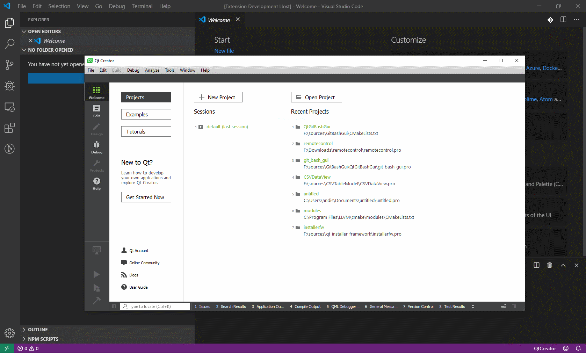

# launchqtcreator README

QtCreator is very useful for certain tasks! When working on Qt projects, there are things I find Qt Creator invaluable for -just too convenient to use anything else (almost). I often use Vislual Studio Code and QtCreator together when working on c++/gui projects

## Features

- launches QtCreator from within code with the click of a button

- if the path to QtCreator is empty then the user is prompted to
  supply the path via a file open dialog

## Requirements

- Visual Studio Code
- QtCreator
- recommended that Qt frame work is also installed

## Extension Settings

'launchqtcreator.qtCreatorPath': configure path to use to launch QtCreator

## Known Issues

no known issues

## Release Notes

### 0.0.1

Initial release - added demo.gif

### 0.0.2

- added a separate ts script file for some creator commands
  - get the path to QtCreator, and then launch QtCreator
  - launch QtCreator

- updated the extension to use async functions and added some 
  'exception' handling to help discover where failuers mught be
  happending when the extension is being used

The extension now will prompt for a path to the QtCreator executable with a FileOpen dialog

-----------------------------------------------------------------------------------------------------------

**Enjoy!**
